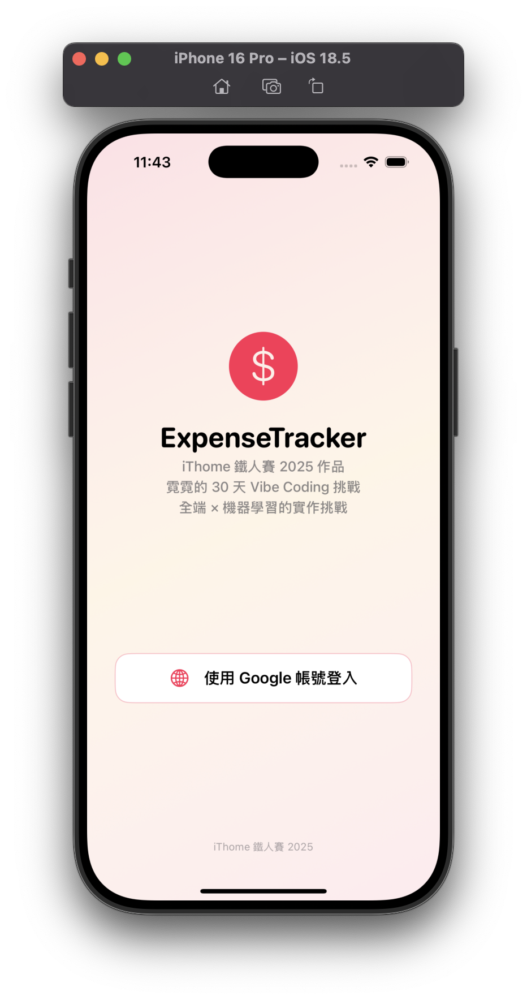
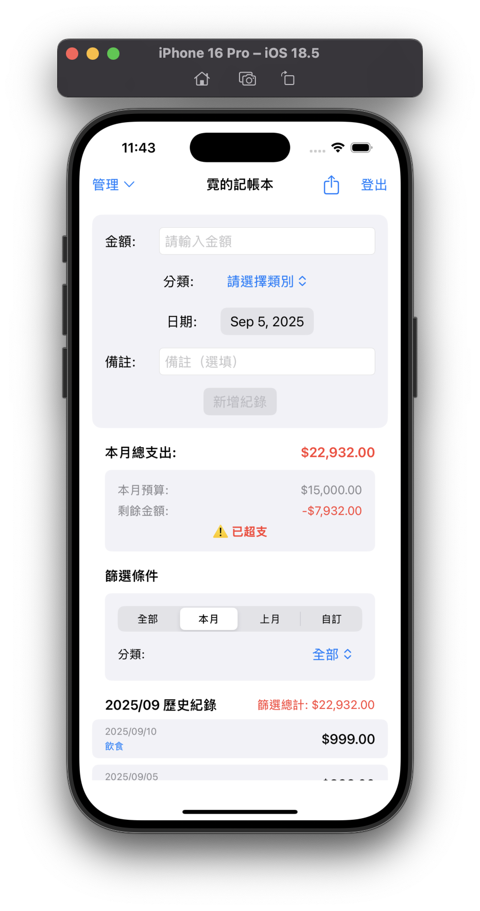
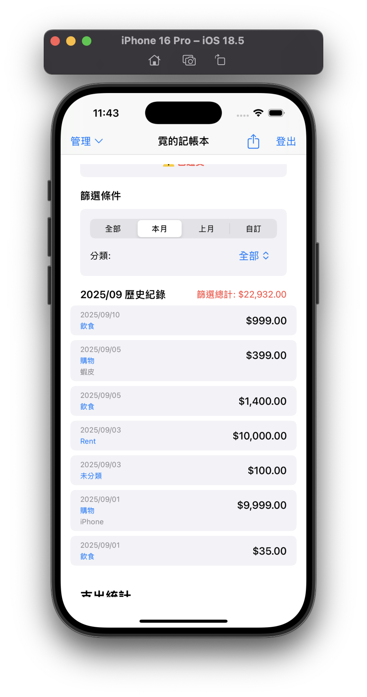
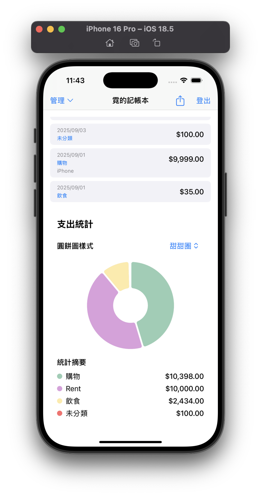

# ExpenseTracker - 記帳本 App

一個使用 **SwiftUI** 開發的簡易記帳 App，作為 [iThome 鐵人賽 2025 — 30 天 Vibe Coding：全端 × 機器學習的實作挑戰](https://ithelp.ithome.com.tw/users/20140998/ironman/8438) 系列的 Side Project。

## 功能特色

### 🔐 使用者認證
- Google 帳號登入
- 自動登入狀態檢查
- 安全登出功能



### 💰 記帳功能
- 金額輸入
- 支出分類選擇（可建立、重新命名、刪除，避免刪除仍在使用的類別）
- 日期選擇（預設今天，可自訂日期區間）
- 備註欄位（記錄用途或細節）
- 即時支出清單（自動依日期排序）
- 本月總支出計算與即時更新
- 長按刪除支出
- 搜尋與篩選
- 快速篩選：全部 / 本月 / 上月 / 自訂日期區間
- 依分類篩選，支援「日期 + 分類」複合條件
- 圖表分析並顯示各類別支出佔比與統計摘要
- 每月預算設定與即時同步，若超過預算時會紅色提示「⚠️ 已超支」







### ☁️ 雲端儲存
- Firebase Firestore 即時資料同步
- 使用者專屬資料隔離
- 自動資料備份

## 技術架構

- **前端**: SwiftUI (iOS 17+)
- **認證**: Firebase Authentication + Google Sign-In
- **資料庫**: Cloud Firestore
- **架構**: MVVM + ObservableObject

## 安裝設定

### 1. 前置需求
- Xcode 15.0+
- iOS 17.0+
- Firebase 專案
- Google Sign-In 設定

### 2. Firebase 設定
1. 在 [Firebase Console](https://console.firebase.google.com/) 建立新專案
2. 啟用 Authentication 和 Firestore
3. 設定 Google Sign-In 提供者
4. 下載 `GoogleService-Info.plist` 並放入專案

### 3. 依賴安裝
專案使用 Swift Package Manager 管理依賴：
- Firebase iOS SDK
- Google Sign-In iOS SDK

### 4. 專案設定
1. 在 Xcode 中開啟專案
2. 確保 Bundle Identifier 與 Firebase 專案一致
3. 設定 Signing & Capabilities
4. 建置並運行

## 資料結構

### Firestore 集合結構
```
users/{userId}/expenses/{expenseId}
```

### Expense 文件欄位
- `id`: 唯一識別碼 (String)
- `amount`: 金額 (Double)
- `category`: 分類 (String)
- `date`: 日期 (Timestamp)

## 使用說明

1. **首次啟動**: 點擊「使用 Google 登入」按鈕
2. **新增支出**: 輸入金額、選擇分類和日期，點擊「新增紀錄」
3. **查看清單**: 所有支出會即時顯示在清單中
4. **刪除支出**: 左滑支出項目即可刪除
5. **登出**: 點擊右上角「登出」按鈕

### 開發過程
專案是在 iThome 鐵人賽 30 天挑戰中完成。雖然每天文章裡都有提供 Prompt，但實際開發並不是只靠這一段就能完成功能，而是需要不斷和 AI 對話、測試與修正，最後才達到理想效果。


## 注意事項

- 需要網路連線才能使用
- 首次登入需要 Google 帳號授權
- 所有資料會自動同步到雲端
- 支援離線使用（資料會在下一次連線時同步）

## 功能演進 
### Day 3 (MVP)
- 新增支出：輸入金額與日期，立即顯示在清單中
- 清單顯示：每筆支出會顯示「日期 | 金額」
- 支援左滑刪除
- 自動加總「本月總支出」
- 使用 UserDefaults + Codable 持久化資料，重開 App 後紀錄仍存在

### Day 4 (雲端同步)
- 加入 Google 登入（Firebase Authentication）
- 所有資料改存 Cloud Firestore
- 每位使用者的支出獨立存放在 users/{uid}/expenses
- 支援跨裝置同步，換機或刪除 App 只要重新登入 Google，紀錄就能回來

### Day 5 (分類／標籤管理)
- 新增「類別」功能：可建立、重新命名、刪除類別
- Firestore 結構改為每位使用者自有類別 users/{uid}/categories，支出放 users/{uid}/expenses
- 新增支出必選類別；支出文件同時寫入 categoryId 與 categoryName（去正規化，列表直接顯示名稱）
- 類別改名時，批次更新該使用者所有相關支出的 categoryName
- 若類別已被使用，阻擋刪除並提示使用者

### Day 6 (統計圖表)
- 使用 Swift Charts 畫出圓餅圖
- 顯示本月各類別支出佔比
- 圖表下方附統計摘要（類別名稱、顏色、金額）
- 支援不同圓餅圖樣式（標準、甜甜圈、3D、漸層）
- 支出資料變動時，統計即時更新

### Day 7 (預算與超支提醒)
- 新增「每月預算」設定，存放於 Firestore：users/{uid}/settings/budget
- 首頁顯示「本月總支出 / 預算 / 剩餘金額」
- 若總支出超過預算，UI 顯示紅色並提示「⚠️ 已超支」
- 預算支援跨裝置同步與即時更新

### Day 8 (搜尋與篩選)
- 預設顯示「本月歷史紀錄」
- 新增快速篩選：全部 / 本月 / 上月 / 自訂日期區間
- 可依「分類」篩選，僅顯示指定類別的支出
- 支援「日期 + 分類」複合篩選，篩選總計會同步更新

### Day 9 (備註功能)
- 支出新增「備註」欄位，可記錄用途或細節（例如「和朋友聚餐」、「Uber 計程車」）
- Firestore 文件結構新增 note: String? 欄位
- 清單顯示支出時，同步顯示備註內容（過長時自動截斷）
- 舊資料（沒有 note 欄位）仍能正常顯示，不會出錯

### Day 10 (匯出功能 + 專案小結)
- 匯出支出紀錄成 CSV / JSON 檔案
- 檔案包含：金額、日期、分類、備註
- 可使用 iCloud / AirDrop / 系統分享功能輸出檔案
- 專案進入總結：功能回顧、踩雷經驗、優化方向

### 未來優化方向
- 增加長條圖、折線圖等報表
- 改善 UI/UX：卡片式清單、動畫
- 加強 Firestore 安全性規則

## 技術棧
- **SwiftUI**
- **iOS 17+**
- **Xcode 15+**
- 資料儲存：UserDefaults (Day 3 MVP) → Firebase Firestore (Day 4)

### 本專案僅供學習與展示使用
### 更多開發細節可參考系列文章：[30 天 Vibe Coding：全端 × 機器學習的實作挑戰](https://ithelp.ithome.com.tw/users/20140998/ironman/8438)
